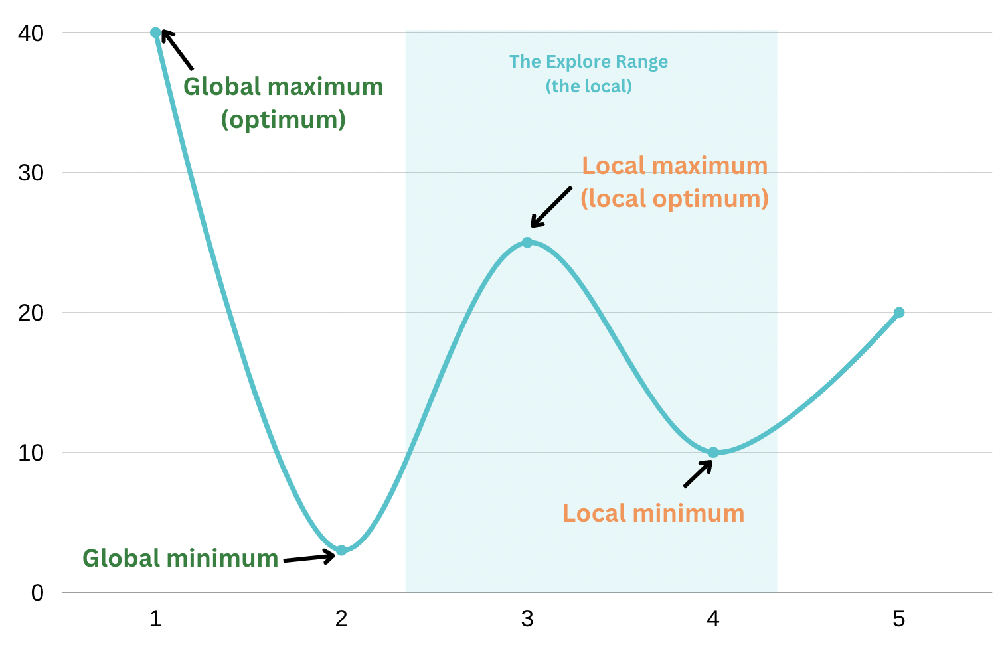

+++
title = 'Tech Recruiting And Local Optima'
date = 2022-11-15T06:37:15+01:00
draft = false
tags = ["hiring", "recruiter", "tech", "talent", "opportunity"]
description = "This post discusses how the recruiting process can be unfair to the talent pool available. Talent is more evenly distributed than opportunities, and it seems we're not addressing that issue enough."

# For twitter cards, see https://github.com/mtn/cocoa-eh-hugo-theme/wiki/Twitter-cards
meta_img = "/images/image.jpg"

# For hacker news and lobsters builtin links, see github.com/mtn/cocoa-eh-hugo-theme/wiki/Social-Links
hacker_news_id = ""
lobsters_id = ""
+++

One of the quotes that stuck in my head over the last few weeks is:

> Talent is more evenly distributed than opportunities. 

That's especially true in the tech industry.

It's why I'm especially fan of remote work. And I often advocate for it. It widens the geo-range in which job opportunities can be redistributed. A step forward to tackle the problem, but is it sufficient? how is it implemented?

You'd think the "evenly distributed" part can only be manifested in terms of the geo-location of talent. But it's not always the case. 

Unfortunately, in times of mass layoffs, and probably a surge in tech interviews, I'm both experiencing and hearing -from peers- frustrating application processes and some recurring patterns being exerted by tech recruiters. Subjective patterns.

As someone who played the role of both the interviewer (recruiter & tech lead) and the interviewee (job applicant), I believe I'm personally identifying some issues I wanted to highlight in this post. Issues that could be hurting top performers, or limiting the scope of talent discovery. Hurting the talent<>opportunities matchmaking process with less fairness.

It's not to blame anyone, it's my little effort to potentially point at some flaws we can all be part of. It boils down to some recruiters trying to play safe -rightfully so- but in the wrong way. Or talents who suck at marketing/showcasing themselves, and/or with little referrals.

In [mathematics](https://en.wikipedia.org/wiki/Maxima_and_minima) / [algorithms](http://www2.denizyuret.com/public_html/pub/aitr1569/node6.html), a local maxima (or maximum) is when there may be higher points (values) elsewhere but not nearby an optimization ([fitness](https://en.wikipedia.org/wiki/Fitness_function)) function (or the extrema). The function will report back the highest value/point within the nearby/exploration range, but not the entire -global- domain. 

> In mathematics and computer science, a local optimum is the best solution to a problem within a small neighborhood of possible solutions.

I see hiring as a fitness/cost function, in which you want to optimize for the right candidate that is a "good fit" for a given position, considering a given cost or a set of company goals. 

That function is influenced by: 
- The talent pool, its diversity or distribution.
- Company goals & budget 
- The recruiter itself. 

We're in times where the talent pool and company goals/budget are themselves influenced by two major events at the time of writing this post, it's a good/bad news for recruiters:
- Good news: mass layoffs happening => seemingly larger talent pool available. 
- Bad news: economic crisis => Different company goals (e.g. less budget, longer runways..)

You -as a recruiter- naturally adapt to that by playing safe, some of the company money is at your play, and with great power comes great responsibility (sometimes, great arrogance). 

But the trap is you might unintentionally predefine a set of rules/assumptions that'd narrow down your explore range or selection from the talent pool without you noticing. 

Here's how you might play safe:
- You focus on tooling/stacks rather than engineering, with titles like: hiring NextJS developer, Svelte developer, {Your_Company_Stack} developer... 
- You look for multi-taskers at the cost of their cognitive overhead & context switching, because they're seemingly cost-effective, with roles like: Full-stack web developer. 
- You run candidates by Leetcode, Hackerrank, and other algorithm riddles that have zero relation with your business domain or engineering, because that's how you filter smart people, right? right? 
- You exclude real good candidates, with real good referrals/feedback, because they're "expensive". 
- You barely give attention, chance or "waste time" with candidates with no-referrals. 
- You exclude those who signal multi-languages/stacks/paradigms experience. Generalist engineers with many years of experience, because you think they can't go deep enough. Jack of all trades.
- You reject valuable talent, because Geo? 
- You are ruling out juniors.

As a result your fitness function is optimizing with a more narrow scope than you might notice. You're rendering out-performers non visible, non-selectable, with your safe-extrema. You're missing out. Your loss.

We, the tech industry, "normalized" full-stack development (~02 runtimes apart), but signaling proficiency in both backend + devops, or multi stacks/languages/paradigms experience or being a generalist might raise a red flag with some tech recruiters? As a jack of all trades, master of none?

A generalist can see from different perspectives, is a good "linker" and problem solver, [a tinkerer](https://walid.dev/blog/stick-to-tinkering/), a real good "on call" dev. A generalist is a jack of all trades, master of any. The more you accumulate experience, the more likely "you've seen it all", you certainly go deep on some stuff, but you also go wide. It correlates well with years of experience. E.g. You can be real good at both backend + devops, because they overlap a lot. Or a real good Svelte + React engineer, because you switched companies/projects over the years.

That is not to be confused with "it pays off to be a specialist". Any experienced generalist has a couple "focus" areas they're a specialist in. It just it happens they're very knowledgeable about other areas too as a result of their experience. And it's huge leverage. Discussing this with one of my friends, I liked the way he put it:

> 100% agree. I think good software engineers —when it comes to tooling— are generalized specialists, with the specialization being a side effect of working with a particular tech stack for a relatively longer period of time, not by being religious about it.

> The key is finding balance between breadth and depth. With too much breadth and little depth, you’re basically a junior at everything; too much depth with very little breadth and you’re basically living in a silo.

Now, is it all about this stacks/generalist/specialist thing? nope. 

**Filtering is also flawed.**

We, the tech industry, embraced Leetcode & hackerrank like tests, which are closer to mathematic/logic riddles than to real world/business problems. They probe algorithmic problem solving skills (with time constraints), not engineering problem solving skills. As a business, what kind of a problem solver you need the most? Not bashing those kind of tests, I'm just trying to point out that, past a certain level, they might not be the correct way to asses skills.

We, the tech industry, need to asses skills by asynchronously giving candidates some of the company's real problems, related directly to the business domain, and see how they'd tackle them. Pick up a real issue from the tracker/roadmap, a bug you experienced. Ask them for an RFC or to do a code review. These are some better ways to see their thought process and evaluate their skills.

Coding/algorithm interviews will render candidates prepare against a metrics system optimizing for grades. Not engineering. Not problem solving. It's [metric fixation](https://aeon.co/ideas/against-metrics-how-measuring-performance-by-numbers-backfires).

**What else? ruling out juniors.**

If juniors are not given a chance to gain expertise, and become seniors, you're contributing to a local optima of another company or the tech industry as a whole. Hurting both the ecosystem and future generations. If you can afford it, take them!

Not only that, some juniors hold so much potential. Some of their [basic] questions are a great way to spot tech debts and actually help fix it. They're also good at spotting documentation gaps. And above all that, they grow quickly to become great developers if guided well.

That is what I could think of in terms of how talent distribution can manifest itself, other than geography. 

What saddens me the most, is when you're not given a chance to prove yourself, prove your worth and the value you can deliver. 

I tried to kind of disguise myself before as a [insert tool here] developer. Or as a backend developer, it worked perfectly. But now that I no longer feel I'm tied to some tool or runtime, why do I need to hide my true value? 

I always thought of this as a "my" problem, I need to work on my first-impression, interviews skills, ..etc but hearing from peers and the recent experiences I went through, having multiple interviews where literally the first thing I hear is: "I've heard good things about you", "strong, solid referrals/feedback", and the likes, and then later you're not a good "fit" for the "role", or "company goal changes" (looking for specialists), multiple times, made me re-evaluate the other side's "fit"ness function and highlight it. It made me realize maybe they're just feeling unsafe, they'd rather stick to common role titles, that is a safe zone to operate the fit-ness function in. Let's admit it, a local optimum is better/safer than a bad choice. I wouldn't expect recruiters to do their due diligence. I just wanted to highlight all of the above.

But you know what gives me chills? remembering I could spot exceptional talent over the years. Individuals I had no prior relation with, zero referrals, on a different continent. People I met not around any given stack or tool. Some of them were juniors. I'm proud of where they are now.
