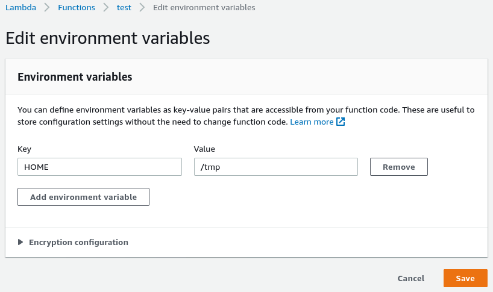
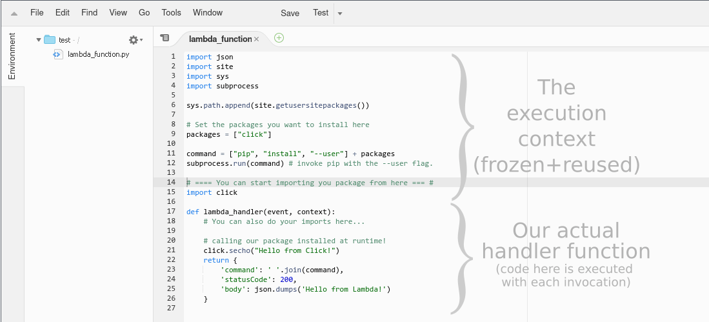
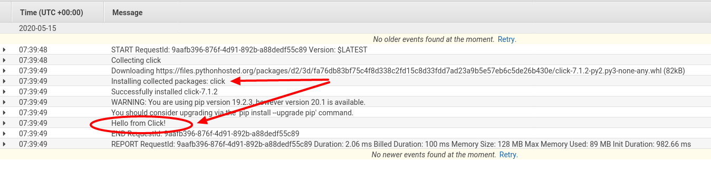

One of the cool tricks I came across was how to write a [self-sufficient AWS Lambda function](https://medium.com/hackernoon/writing-a-self-sufficient-aws-lambda-function-da6c0586f48c), the idea is to have your Lambda function installs its dependencies at runtime/require time, instead of having to redeploy it each time you add a new dependency.

The trick shared by Chathura Widanage was specific to Nodejs. I immediately wanted to replicate it, but for Python runtimes instead. 

This is especially useful if you want to iterate faster on your new Lambda function, experiment, test or debug it on the fly. This is likely not suited for your production code, obviously this will add some overhead to your Lambda cold start time, but then any successive calls will be snappy (once the dependencies are installed). The test framework of [Sigma IDE](https://www.slappforge.com/sigma) uses this concept.

So how to make Python's setuptools or pip install packages on the fly for us, and have our Python code use those newly installed packages?

# Knowing the runtime

AWS Lambda gives you a non persistent space of **512MB** at `/tmp`, which is the only **writable** path in Lambda containers.

It then provides a **execution context**, which is any code outside of the actual function's handler method. The execution context can be used to initialize DB connections, HTTP endpoints, ..etc AWS Lambda **freezes** the execution context after the first run for some time in anticipation of another function invocation, and tries to **reuse** it for subsequent invocations of the Lambda function. I recommend reading [AWS Lambda execution context](https://docs.aws.amazon.com/lambda/latest/dg/runtimes-context.html). 

By default, Python puts its installed packages at `/usr/lib/pythonX.Y/site-packages` where `/usr` (sometimes `/usr/local`) is known as the prefix (`sys.prefix`). 

This is hardcoded when you compile Python and you do `./configure --prefix=..`. Depending on your Linux distribution / OS, `sys.prefix` could slightly differ.  

This prefix can be manipulated, that's how tools like [virtualenv](https://virtualenv.pypa.io) work, but there's a whole machinery behind the scene to make virtual environments work and use the standard library at the hardcoded  `sys.prefix` without breaking things. 


You might also think you can change `$PYTHONHOME`, but it's not as simple as that, you'll need to copy the Python binary, and do other manipulations. If you really want to get down the rabbit hole, I recommend [this talk](https://pyvideo.org/pycon-us-2011/pycon-2011--reverse-engineering-ian-bicking--39-s.html) (slides [here](http://carljm.github.io/pipvirtualenv-preso/#1)).


Instead, I thought about the [site](https://docs.python.org/3/library/site.html) module, specifically, user-specific site-packages via `site.USER_SITE` and `site.getusersitepackages()`.

User-specific site packages default to `~/.local/lib/pythonX.Y/site-packages` where `~` expands to the user's `$HOME`. 

By changing `$HOME` to `/tmp` (our writable path), we can have `pip install --user <you-desired-packge>` install the package in `/tmp`. So that's what I did.


First, you'll of course need to set your `$HOME` to `/tmp` in AWS Lambda:



from there, invoking `pip install --user <your-desired-package>` on the lambda container would install the `<your-desired-package>` in `/tmp/.local/lib/pythonX.Y/site-packages`. Or what we now know as `site.getusersitepackages()`. 

`pip` can be invoked in code (in a lazy manner) with:

```python
import subprocess
subprocess.run(["pip", "install", "--user", "the-package"])
```

So far we made our Lambda function know where to install packages, but still, it does not know from where to "import" them. That is easily achievable with: 

```python
import site
import sys
sys.path.append(site.getusersitepackages())
```

**Explanation:**

- Calling `site.getusersitepackages()` (for the first time) will set `site.USER_BASE` to our [new] `$HOME`, and construct a proper `/tmp/.local/lib/pythonX.Y/site-packages`.
- That path is appended to `sys.path` so future `import`s (coming after the above statement) would consider it as a searching path for packages/modules.


### The final craft would be:



And here are the logs you love to see:




That's it. Thoughts?